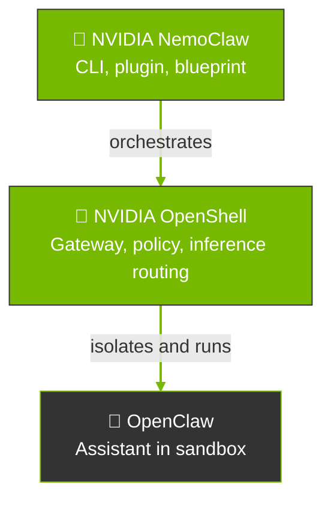
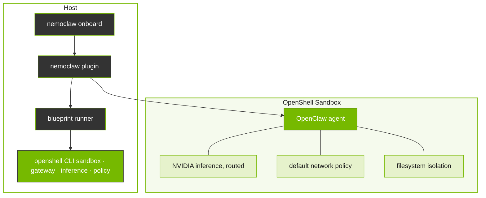

# NemoClaw Overview

Explains how OpenClaw, OpenShell, and NemoClaw form the ecosystem, NemoClaw’s position in the stack, and when to prefer NemoClaw versus integrating OpenShell and OpenClaw directly. Use when users ask about the relationship between OpenClaw, OpenShell, and NemoClaw, or when to use NemoClaw versus OpenShell.

## Context

NemoClaw provides onboarding, lifecycle management, and management of OpenClaw within OpenShell containers.

This page describes how the ecosystem is formed across projects, where NemoClaw sits relative to [OpenShell](https://github.com/NVIDIA/OpenShell) and [OpenClaw](https://openclaw.ai), and how to choose between NemoClaw and OpenShell.

## How the Stack Fits Together

Three pieces usually appear together in a NemoClaw deployment, each with a distinct scope:

| Project                                          | Scope                                                                                                                                                                                                                                                                                    |
| ------------------------------------------------ | ---------------------------------------------------------------------------------------------------------------------------------------------------------------------------------------------------------------------------------------------------------------------------------------- |
| [OpenClaw](https://openclaw.ai)                  | The assistant: runtime, tools, memory, and behavior inside the container. It does not define the sandbox or the host gateway.                                                                                                                                                            |
| [OpenShell](https://github.com/NVIDIA/OpenShell) | The execution environment: sandbox lifecycle, network and filesystem policy, inference routing, and the operator-facing `openshell` CLI for those primitives.                                                                                                                            |
| NemoClaw                                         | The NVIDIA reference stack that implements the definition above on the host: `nemoclaw` CLI and plugin, versioned blueprint, channel messaging configured for OpenShell-managed delivery, and state migration helpers so OpenClaw runs inside OpenShell in a documented, repeatable way. |

NemoClaw sits above OpenShell in the operator workflow.
It drives OpenShell APIs and CLI to create and configure the sandbox that runs OpenClaw.
Models and endpoints sit behind OpenShell’s inference routing.
NemoClaw onboarding wires provider choice into that routing.

## NemoClaw Path versus OpenShell Path

Both paths assume OpenShell can sandbox a workload.
The difference is who owns the integration work.

| Path               | What it means                                                                                                                                                                                                                                |
| ------------------ | -------------------------------------------------------------------------------------------------------------------------------------------------------------------------------------------------------------------------------------------- |
| **NemoClaw path**  | You adopt the reference stack. NemoClaw’s blueprint encodes a hardened image, default policies, and orchestration so `nemoclaw onboard` can stand up a known-good OpenClaw-on-OpenShell setup with less custom glue.                         |
| **OpenShell path** | You use OpenShell as the platform and supply your own container, install steps for OpenClaw, policy YAML, provider setup, and any host bridges. OpenShell stays the sandbox and policy engine; nothing requires NemoClaw’s blueprint or CLI. |

## When to Use Which

Use the following table to decide when to use NemoClaw versus OpenShell.

| Situation                                                                                                                                     | Prefer                              |
| --------------------------------------------------------------------------------------------------------------------------------------------- | ----------------------------------- |
| You want OpenClaw with minimal assembly, NVIDIA defaults, and the documented install and onboard flow.                                        | NemoClaw                            |
| You need maximum flexibility: custom images, a layout that does not match the NemoClaw blueprint, or a workload outside this reference stack. | OpenShell with your own integration |
| You are standardizing on the NVIDIA reference for always-on assistants with policy and inference routing.                                     | NemoClaw                            |
| You are building internal platform abstractions where the NemoClaw CLI or blueprint is not the right fit.                                     | OpenShell (and your orchestration)  |

_Full details in `references/ecosystem.md`._

This page explains how NemoClaw operates, which parts run where, how the blueprint drives OpenShell, and how inference and policy attach to the sandbox.

## How the Pieces Connect

The `nemoclaw` CLI is the primary entrypoint for setting up and managing sandboxed OpenClaw agents.
It delegates heavy lifting to a versioned blueprint, a Python artifact that orchestrates sandbox creation, policy application, and inference provider setup through the OpenShell CLI.

Between your shell and the running sandbox, NemoClaw contributes these integration layers:

| Layer             | Role in the flow                                                                                                                                                                                                  |
| ----------------- | ----------------------------------------------------------------------------------------------------------------------------------------------------------------------------------------------------------------- |
| Onboarding        | `nemoclaw onboard` validates credentials, selects providers, and drives blueprint execution until the sandbox is ready.                                                                                           |
| Blueprint         | Supplies the hardened image definition, default policies, capability posture, and orchestration steps the runner applies through OpenShell.                                                                       |
| State management  | Migrates agent state across machines with credential stripping and integrity checks.                                                                                                                              |
| Channel messaging | OpenShell-managed processes connect Telegram, Discord, Slack, and similar platforms to the agent. NemoClaw enables this through onboarding and blueprint wiring; delivery is not a separate NemoClaw host daemon. |

For repository layout, file paths, and deeper diagrams, see Architecture (see the `nemoclaw-reference` skill).

## Design Principles

NemoClaw architecture follows the following principles.

_Full details in `references/how-it-works.md`._

NVIDIA NemoClaw is an open source reference stack that simplifies running [OpenClaw](https://openclaw.ai) always-on assistants.
NemoClaw provides onboarding, lifecycle management, and management of OpenClaw within OpenShell containers.
It incorporates policy-based privacy and security guardrails, giving you control over your agents’ behavior and data handling.
This enables self-evolving claws to run more safely in clouds, on prem, RTX PCs and DGX Spark.

NemoClaw pairs open source and hosted models (for example [NVIDIA Nemotron](https://build.nvidia.com)) with a hardened sandbox, routed inference, and declarative egress policy so deployment stays safer and more repeatable.
The sandbox runtime comes from [NVIDIA OpenShell](https://github.com/NVIDIA/OpenShell); NemoClaw adds the blueprint, `nemoclaw` CLI, onboarding, and related tooling as the reference way to run OpenClaw there.

| Capability           | Description                                                                                                                                                                                                                                                                                          |
| -------------------- | ---------------------------------------------------------------------------------------------------------------------------------------------------------------------------------------------------------------------------------------------------------------------------------------------------- |
| Sandbox OpenClaw     | Creates an OpenShell sandbox pre-configured for OpenClaw, with filesystem and network policies applied from the first boot.                                                                                                                                                                          |
| Route inference      | Configures OpenShell inference routing so agent traffic goes to the provider and model you chose during onboarding (NVIDIA Endpoints, OpenAI, Anthropic, Gemini, compatible endpoints, local Ollama, and others). The agent uses `inference.local` inside the sandbox; credentials stay on the host. |
| Manage the lifecycle | Handles blueprint versioning, digest verification, and sandbox setup.                                                                                                                                                                                                                                |

## Key Features

NemoClaw provides the following product capabilities.

| Feature            | Description                                                                                                                                                                                                                                     |
| ------------------ | ----------------------------------------------------------------------------------------------------------------------------------------------------------------------------------------------------------------------------------------------- |
| Guided onboarding  | Validates credentials, selects providers, and creates a working sandbox in one command.                                                                                                                                                         |
| Hardened blueprint | A security-first Dockerfile with capability drops, least-privilege network rules, and declarative policy.                                                                                                                                       |
| State management   | Safe migration of agent state across machines with credential stripping and integrity verification.                                                                                                                                             |
| Channel messaging  | OpenShell-managed processes connect Telegram, Discord, Slack, and similar platforms to the sandboxed agent. NemoClaw configures channels during onboarding; OpenShell supplies the native constructs, credential flow, and runtime supervision. |
| Routed inference   | Provider-routed model calls through the OpenShell gateway, transparent to the agent. Supports NVIDIA Endpoints, OpenAI, Anthropic, Google Gemini, and local Ollama.                                                                             |
| Layered protection | Network, filesystem, process, and inference controls that can be hot-reloaded or locked at creation.                                                                                                                                            |

## Challenge

Autonomous AI agents like OpenClaw can make arbitrary network requests, access the host filesystem, and call any inference endpoint. Without guardrails, this creates security, cost, and compliance risks that grow as agents run unattended.

## Benefits

NemoClaw provides the following benefits.

| Benefit                    | Description                                                                                                                                                                                                               |
| -------------------------- | ------------------------------------------------------------------------------------------------------------------------------------------------------------------------------------------------------------------------- |
| Sandboxed execution        | Every agent runs inside an OpenShell sandbox with Landlock, seccomp, and network namespace isolation. No access is granted by default.                                                                                    |
| Routed inference           | Model traffic is routed through the OpenShell gateway to your selected provider, transparent to the agent. You can switch providers or models. Refer to Inference Options (see the `nemoclaw-configure-inference` skill). |
| Declarative network policy | Egress rules are defined in YAML. Unknown hosts are blocked and surfaced to the operator for approval.                                                                                                                    |
| Single CLI                 | The `nemoclaw` command orchestrates the full stack: gateway, sandbox, inference provider, and network policy.                                                                                                             |
| Blueprint lifecycle        | Versioned blueprints handle sandbox creation, digest verification, and reproducible setup.                                                                                                                                |

## Use Cases

You can use NemoClaw for various use cases including the following.

| Use Case              | Description                                                                            |
| --------------------- | -------------------------------------------------------------------------------------- |
| Always-on assistant   | Run an OpenClaw assistant with controlled network access and operator-approved egress. |
| Sandboxed testing     | Test agent behavior in a locked-down environment before granting broader permissions.  |
| Remote GPU deployment | Deploy a sandboxed agent to a remote GPU instance for persistent operation.            |

_Full details in `references/overview.md`._

## Reference

- [NemoClaw Release Notes](references/release-notes.md)

## Related Skills

- `nemoclaw-get-started` — Quickstart to install NemoClaw and run your first agent
- `nemoclaw-configure-inference` — Switch Inference Providers to configure the inference provider
- `nemoclaw-manage-policy` — Approve or Deny Network Requests to manage egress approvals
