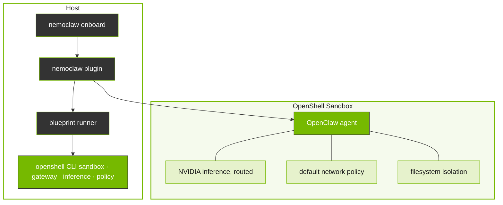

# How NemoClaw Works

This page explains how NemoClaw operates, which parts run where, how the blueprint drives OpenShell, and how inference and policy attach to the sandbox.

## How the Pieces Connect

The `nemoclaw` CLI is the primary entrypoint for setting up and managing sandboxed OpenClaw agents.
It delegates heavy lifting to a versioned blueprint, a Python artifact that orchestrates sandbox creation, policy application, and inference provider setup through the OpenShell CLI.

Between your shell and the running sandbox, NemoClaw contributes these integration layers:

| Layer             | Role in the flow                                                                                                                                                                                                  |
| ----------------- | ----------------------------------------------------------------------------------------------------------------------------------------------------------------------------------------------------------------- |
| Onboarding        | `nemoclaw onboard` validates credentials, selects providers, and drives blueprint execution until the sandbox is ready.                                                                                           |
| Blueprint         | Supplies the hardened image definition, default policies, capability posture, and orchestration steps the runner applies through OpenShell.                                                                       |
| State management  | Migrates agent state across machines with credential stripping and integrity checks.                                                                                                                              |
| Channel messaging | OpenShell-managed processes connect Telegram, Discord, Slack, and similar platforms to the agent. NemoClaw enables this through onboarding and blueprint wiring; delivery is not a separate NemoClaw host daemon. |

For repository layout, file paths, and deeper diagrams, see Architecture (see the `nemoclaw-reference` skill).

## Design Principles

NemoClaw architecture follows the following principles.

Thin plugin, versioned blueprint
: The plugin stays small and stable. Orchestration logic lives in the blueprint and evolves on its own release cadence.

Respect CLI boundaries
: The `nemoclaw` CLI is the primary interface for sandbox management.

Supply chain safety
: Blueprint artifacts are immutable, versioned, and digest-verified before execution.

OpenShell-backed lifecycle
: NemoClaw orchestrates OpenShell resources under the hood, but `nemoclaw onboard`
is the supported operator entry point for creating or recreating NemoClaw-managed sandboxes.

Reproducible setup
: Running setup again recreates the sandbox from the same blueprint and policy definitions.

## Plugin and Blueprint

NemoClaw is split into two parts:

- The _plugin_ is a TypeScript package that registers an inference provider and the `/nemoclaw` slash command inside the sandbox.
  It handles user interaction and delegates orchestration work to the blueprint.
- The _blueprint_ is a versioned Python artifact that contains all the logic for creating sandboxes, applying policies, and configuring inference.
  The plugin resolves, verifies, and executes the blueprint as a subprocess.

This separation keeps the plugin small and stable while allowing the blueprint to evolve on its own release cadence.

## Sandbox Creation

When you run `nemoclaw onboard`, NemoClaw creates an OpenShell sandbox that runs OpenClaw in an isolated container.
The blueprint orchestrates this process through the OpenShell CLI:

1. The plugin downloads the blueprint artifact, checks version compatibility, and verifies the digest.
2. The blueprint determines which OpenShell resources to create or update, such as the gateway, inference providers, sandbox, and network policy.
3. The blueprint calls OpenShell CLI commands to create the sandbox and configure each resource.

After the sandbox starts, the agent runs inside it with all network, filesystem, and inference controls in place.

## Inference Routing

Inference requests from the agent never leave the sandbox directly.
OpenShell intercepts every inference call and routes it to the configured provider.
During onboarding, NemoClaw validates the selected provider and model, configures the OpenShell route, and bakes the matching model reference into the sandbox image.
The sandbox then talks to `inference.local`, while the host owns the actual provider credential and upstream endpoint.

## Protection Layers

The sandbox starts with a default policy that controls network egress, filesystem access, process privileges, and inference routing.

| Layer      | What it protects                                         | When it applies             |
| ---------- | -------------------------------------------------------- | --------------------------- |
| Network    | Blocks unauthorized outbound connections.                | Hot-reloadable at runtime.  |
| Filesystem | Prevents reads and writes outside `/sandbox` and `/tmp`. | Locked at sandbox creation. |
| Process    | Blocks privilege escalation and dangerous syscalls.      | Locked at sandbox creation. |
| Inference  | Reroutes model API calls to controlled backends.         | Hot-reloadable at runtime.  |

When the agent tries to reach an unlisted host, OpenShell blocks the request and surfaces it in the TUI for operator approval. Approved endpoints persist for the current session but are not saved to the baseline policy file.

For details on the baseline rules, refer to Network Policies (see the `nemoclaw-reference` skill). For container-level hardening, refer to Sandbox Hardening (see the `nemoclaw-deploy-remote` skill).

## Next Steps

- Read Ecosystem (see the `nemoclaw-overview` skill) for stack-level relationships and NemoClaw versus OpenShell-only paths.
- Follow the Quickstart (see the `nemoclaw-get-started` skill) to launch your first sandbox.
- Refer to the Architecture (see the `nemoclaw-reference` skill) for the full technical structure, including file layouts and the blueprint lifecycle.
- Refer to Inference Options (see the `nemoclaw-configure-inference` skill) for detailed provider configuration.
